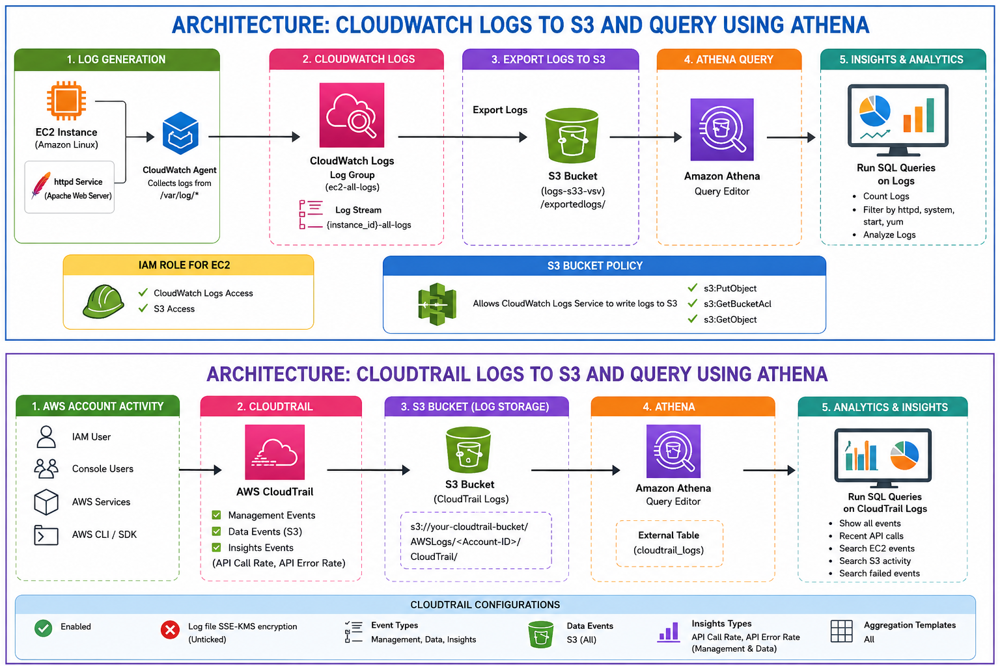

# AWS Log Analytics Using CloudWatch, CloudTrail & Athena



## Overview

This project demonstrates how to collect, store, and analyze AWS logs using:

- Amazon CloudWatch
- AWS CloudTrail
- Amazon S3
- Amazon Athena

The architecture helps monitor EC2 logs, AWS API activity, S3 events, and perform SQL-based log analysis using Athena.

---

# Architecture Flow

1. EC2 instances generate system and application logs.
2. CloudWatch Agent collects logs from `/var/log/*`.
3. CloudWatch Logs exports logs to Amazon S3.
4. AWS CloudTrail captures API calls and account activity.
5. CloudTrail stores logs inside S3 buckets.
6. Amazon Athena queries logs directly from S3.
7. SQL queries are used to filter logs by:
   - Date
   - Time
   - Errors
   - Services
   - API calls
8. Insights events help detect unusual API activity.
9. IAM Roles provide secure access to CloudWatch and S3.
10. Centralized logging improves monitoring and troubleshooting.

---

# AWS Services Used

- Amazon EC2
- Amazon CloudWatch
- AWS CloudTrail
- Amazon S3
- Amazon Athena
- IAM Roles & Policies

---

# Features

- Centralized log storage
- Query logs using SQL
- Monitor EC2 and AWS activity
- Detect failed API calls
- Analyze S3 and EC2 events
- Export logs securely to S3
- Time-based and date-based log filtering

---

# Sample Use Cases

- Security auditing
- Troubleshooting EC2 issues
- Monitoring S3 access
- Tracking API activity
- Finding failed AWS operations
- Analyzing HTTPD logs
- Monitoring user actions

---


# Benefits

- Serverless log analytics
- Low-cost centralized logging
- Real-time monitoring support
- Easy integration with AWS services
- Scalable log analysis platform

---
```
# Athena
